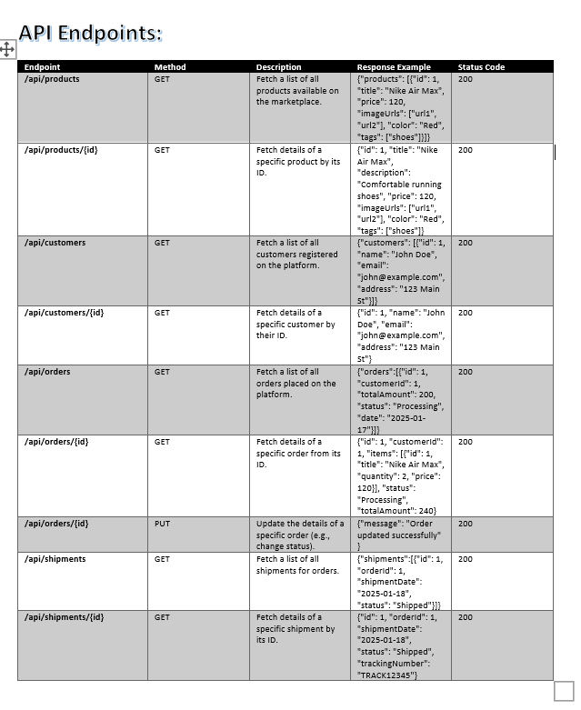

## Hackathon 3 - Day 2: Planning the Technical Foundation
Prepared by: Anum Kamal

# Nike Marketplace

# Overview:

This Nike marketplace is a sleek and modern platform designed for fitness enthusiasts, athletes, and casual wear lovers aged 18-45. It offers a seamless shopping experience with a curated selection of authentic Nike products, including shoes, T-shirts, jackets, socks, tracksuits, and accessories for both men and women. Built using **Next.js** for the frontend and powered by Sanity CMS for efficient content management, the platform ensures fast performance, dynamic product listings, and user-friendly navigation. It bridges the gap in access to high-quality Nike merchandise, delivering style and functionality straight to your doorstep.
The platform offers a wide range of Nike products with a user-friendly shopping experience, including:
•	Authentic Nike products, including shoes, clothing, and accessories.
•	Seamless shopping experience with easy navigation.
•	Detailed product descriptions and high-quality images.
•	Secure and convenient purchasing options.

## 1. Define Technical Requirements:

# Frontend Requirements: 
 The frontend of the Nike Marketplace website is built with Next.js, ensuring a fast, responsive user experience. It provides customers with a seamless shopping journey while showcasing authentic Nike products in a visually appealing and intuitive design.

Frontend Technologies:
•	Next.js: A powerful and fast framework that guarantees excellent performance and mobile-first design.

•	Tailwind CSS: A utility-first CSS framework for building responsive and visually appealing designs with minimal effort.

•	Shadcn UI: A modern UI component library that enhances the user interface with pre-designed, customizable components that streamline development and improve consistency across the application.

•	ShipEngine: Provides shipment tracking and delivery updates.

•	Stripe: A secure and reliable payment gateway to handle transactions and various payment methods, ensuring safe and smooth online purchases.

Essential Pages:
•	Home Page: Highlights featured Nike products and promotions, encouraging users to explore the site.
•	Product Listing Page: Displays Nike products with filtering and sorting options for a tailored shopping experience.
•	Product Details Page: Offers detailed information about each Nike product, including images, price, and available options.
•	Cart Page: Allows users to review selected items and proceed to checkout.
•	Checkout Page: Facilitates secure payment and collection of shipping information.
•	Order Confirmation Page: Confirms the successful placement of an order with tracking details.

 # Sanity CMS as Backend: 
Sanity CMS serves as the backend for managing and organizing product, customer, and order data for the Nike Marketplace website. It integrates seamlessly with the Next.js frontend, ensuring smooth data handling and real-time updates.

## Why Sanity CMS?
•	Customizable Schemas: Easily define how product, customer, and order data should be structured.
•	Real-Time Updates: Instant updates to Nike product and order data across the site.
•	Simple Management: Intuitive interface for managing Nike product listings and making updates.
Sanity CMS ensures that Nike product listings, customer details, and orders are always up-to-date, offering a streamlined process for content management and ensuring a seamless experience for Nike customers.
	Third-Party APIs: To enhance functionality and deliver a seamless shopping experience, the Nike Marketplace integrates third-party APIs for critical backend services:
•	Shipment Tracking (ShipEngine): Provides real-time tracking of Nike orders, ensuring customers can monitor the progress of their shipments.
•	Payment Gateway (Stripe): Manages secure payment processing, allowing customers to make safe and smooth transactions for Nike products.

## 2. System Architecture:
 
! [System Architecture Workflow Diagram] (System architecture.PNG)

## APIEndpoints

